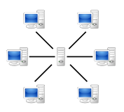
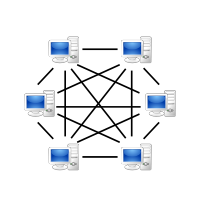
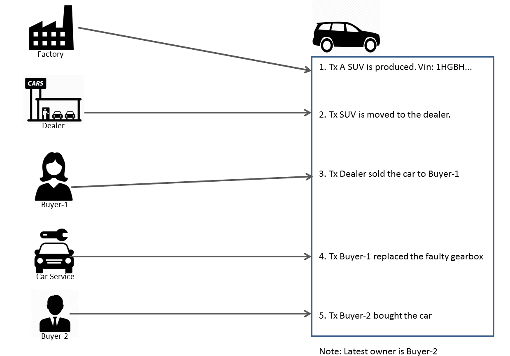
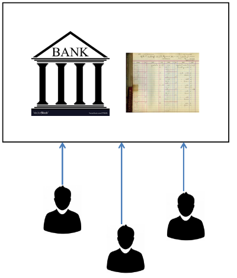
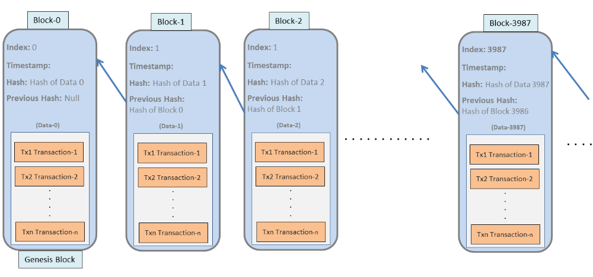
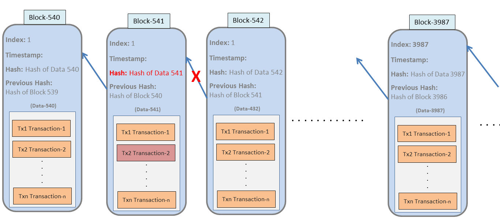

The term Blockchain became popular with the rise and popularity of Bitcoin  and other cryptocurrencies. People madly invested in it with the  intention of quicker return of investment. Bitcoin and other  cryptocurrencies are but one application use case of the blockchain.

Blockchain is a new technology with some unique property that can solve many real  world problems. Of course it is not solution of all problems but it has  its unique use cases.

So understanding what blockchain is and how it works will be very much  helpful in deciding where you can use this technology. Even if you are  just a cryptocurrency investor knowing how it works will boost your  trust in it.

# 1. What is Blockchain?

Blockchain is a *decentralized system* for exchanging of values

- That uses synchronized *distributed ledger* to store transaction records where transactions can be added but cannot be modified or deleted.
- Where the transaction immutability is achieved through bundling the transaction records into the *blocks and then chaining* them in an intelligent way.
- Where the participants of the network maintains the same copy of the transaction ledger. The participants leverages on *Consensus* mechanism for agreeing upon the validity of a transaction.
- Security, trust and accountability is achieved through Public Key *Cryptography*.

All the above points will be clarified in the upcoming sections.

# 2. Blockchain Concepts

## 2.1 Decentralization

Blockchain is a decentralized peer to peer network.

| Client-Server network                                 | Peer-to-Peer network                              |
| ----------------------------------------------------- | ------------------------------------------------- |
|  |  |

World Wide Web is built on a centralized network architecture where the nodes are connected to a central server. The server serves whereas the  connected nodes are the consumers of the service provided by the server. This model has a problem of Single Point Failure. If the server is down the service will be down.

On the other hand, blockchain runs on a decentralized peer-to-peer network where all the nodes are equal. All nodes act as a server. So there is  no single point failure in Blockchain network.

## 2.2 Exchange of value

Any asset that can be digitally represented as value can be exchanged in a blockchain network.

For example, you can build and run a custom blockchain network to maintain  car lifecycle starting from its production till its destruction. Every  time the car gets transferred from one owner to another a transaction  gets recorded in the chain. Because these transaction records are  immutable and is impossible to tamper anyone through a Distributed  web/mobile/desktop application can search for cars history and so on. 
Another similar types of distributed application is: land registration where a  blockchain can record all the transactions for that specific land which  will really be a peace of mind for the land buyer.

## 2.3 Distributed Ledger

In the traditional system transactions are recorded in a central ledger. A good example is Bank. Bank maintains a central ledger and any time any  transfer occurs the bank records an entry in its ledger. This ledger  represent the true value of customers asset (in this case money). If  somehow this central ledger gets altered the customers bank account will start showing different asset value.

In a blockchain network the participating peers keeps a copy of the  ledger. Every peer have the same copy of the ledger. If any user wishes  to transfer asset to other user all the peers gets the proposal of that  transaction. Everyone can simulate the validity of that proposed  transaction against their local copy of the ledger and then approve. So  in blockchain system it is impossible to alter the ledger as if one peer does so others can easily recognize the discrepancy in comparing with  their local copy.

## 2.4 Block and Chaining

Traditional database technology are built for CRUD(Create, Retrieve, Update and  Delete) operation. But blockchain database mechanism allows only Create  (C) and Retrieve (R) operation.

Transactions are grouped together into unit. This unit is called block. Block 0 is a special block which is called Genesis block.
Other than transaction data there are some other properties (ie. fields) of each of the block. They are:

- Index: Index is the block number. It is sequential.
- Timestamp: This represents the time the block was generated.
- Hash value: It is a specific value which is generated from the transaction  data of this block. This ensures the the integrity of the data. Hash  value is generated from a specific mathematical function and it is so  sensitive that a minor change in data will generate a different hash  value. Please check the article “[Cryptography Hash Function](https://www.tutorialspoint.com/cryptography/cryptography_hash_functions.htm)” to know details on Hash function.
- Previous hash value: This is the hash value of the previous block. Because each  block is pointing to the previous block this creates a chain of all  blocks. Hence the network is a Blockchain network.

This data structure ensures the immutability of data as anyone with the  access of the ledger can check if the ledger was tampered or not.

Every node can check if the transaction data was tampered. Starting from the  latest block for each block it can calculate the hash value for the  previous block and then compare with the stored value of the property  “previous has value”. If there is a mismatch then for sure the  transaction data was tampered and that breaks the chain. In the above  example:

1. The intruder managed to tamper a specific transaction in Block 541
2. When a participating node is checking the validity of the block 542, it will first calculate the Hash value of the previous block 541.
3. Because the Transaction Tx2 is tampered the calculated hash value will be different from the stored “Previous Hash”.
4. So the chain will be broken and the fraud will be detected.

Each node can thus check the validity of the blocks up till the beginning of the chain. So if a hacker wants to tamper a chain he/she needs to  modify the whole chain.

## 2.5 Consensus

One aspect of proper functioning of distributed ledger is how to ensure  that same data is seen across the network without any central authority  controlling the replication of the data to each peer. In simple term  consensus is the protocol by which the peers agree upon the state of the ledger.

Consensus mechanism make sure that the copy of the ledger is same in all the nodes/peers.

It also ensures that fraudulent transactions are kept out of the ledger  and guarantees the transactions are in chronological order.

There are multiple consensus protocols. Popular one are: Proof-of-work, Proof-of-Stake, Tendermint and so on.

Bitcoin and Ethereum blockchain network are using the Proof-of-work consensus mechanism.

## 2.6 Cryptography

Participants of the blockchain network have public/private key pair. Those of you  who purchased and transferred Bitcoin or Ethereum you know that you  needed to create your wallet. When you created your wallet you were given two large numbers: public key and private key.

When an owner wants to transfer some asset to another then

- a hash of that transaction data is generated.
- This hash is signed(encrypted) by the public key of the owner
- This encrypted has along with the transaction data is sent to the network.
- Nodes receives this desired transaction request, they decrypt the hash with public key of the owner.
- Nodes then generate hash at their end from the provided transaction data.
- If these this hash matches with the decrypted hash then it is proven that this is a valid transaction.

# 3. Conclusion

This how blockchain works in very brief. Blockchain and Bitcoin are hype  words now. Cryptocurrency is not only the application of the blockchain  technology. Blockchain can be used in multiple real life use cases.  Blockchain specially can be very useful in the cases of different  enterprise use cases. In my next articles I will cover on Hyperledger  Fabric which is a permissioned blockchain network suitable for  organizations.