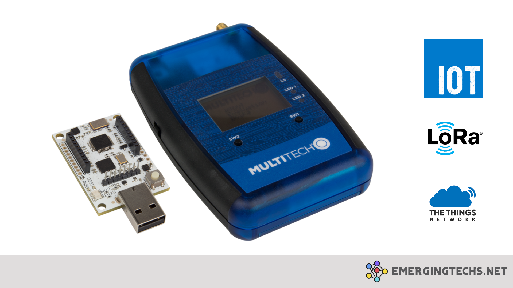
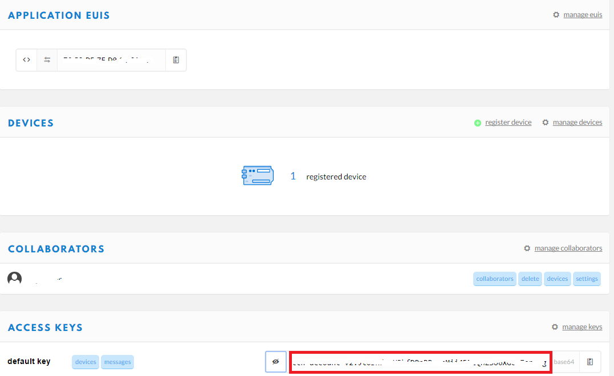

**MultiConnect MTDOT box** is a is a portable handheld LoraWAN end-point. This device  can be used to mimic LoraWAN enabled IoT devices for prototyping  proof-of-concept IoT applications. Also this device is very useful for  conducing LoraWAN site survey and gathering link related data (ie signal strength and so on).

## The Things Network

The Things Network is enabling LoraWAN devices to connect to an open source and decentralized network through their local LoraWAN gateways. IoT  devices (ie. Temperature, air quality, water level sensors and so on)  connected to LoraWAN gateways can exchange data through application  created in The Things Network.

# Steps to connect mDot Box with The Things Network

## 1. Configuration at The Things Network Portal

- Create a new application in The Things Network(TTN) Portal. Application ID needs to be unique.

- Open your application and ‘Register Device’. For mDot Box you will find the  Device EUI at the back of your device titled as “NODE:”.

- Write down or copy your “Application ID” and “Access Key”. Open your  application from TTN console and you will find these two information.  Copy them somewhere.

- Write down or copy “Application EUI” and “App Key”. Inside your application  if you open details screen of your mDot Box device you will these two  information.

## 2. Configure mDot Box

Now the mDot box needs to be configured with The Things Network application that we just created. To configure the mDot device we need the  following:

- Micro Developer Kit (MDK)
- [The device driver for the configuration port](https://developer.mbed.org/teams/st/wiki/ST-Link-Driver/) (Only available for windows)

After installing the device driver follow the following steps:

- Connect mDot box to the MDK using the ribbon cable provided.
- Connect MDK to the computer via USB connector.

- In Windows 10 go to `This PC --> Properties --> Device Manager` and find out the COM port where your mDot is connected.
- Open putty (download putty beforehand) and connect to the tty/COM port at 115200bps.
- Select SW1 to select Configuration from the mDot main menu.
- Enter AT command you wish to execute.
- Type `help` to see all possible AT commands with descriptions.

- Type `AT&V` to see the current device configuration.

- Or type type any command and ? to see the stored value. For example: to  check the value of Application EUI assigned in your device execute `AT+NI?`
- To assign a new Application EUI use the command `AT+NI=value`
- I am assuming that the mDot box is properly configured with your LoRaWAN gateway parameters.
- We will need only to execute two commands to execute to setup our mDot Box to work with our TTN Application.
- And in the previous step we copied “Application EUI” and “App Key” which we will need to set our mDot Box.
- Execute `AT+NI=Application EUI (colon separated each two characters)`
- Then execute `AT+NK=App Key (colon separated each two characters)`
- Now execute `AT&W` to save the changes.
- And `AT+EXIT` to exit the AT console.
- We are done setting up mDot Box.
- Now disconnect your mDot from the MDK (ie the Kit). Switch it on.
- In TTN portal open the application and go to Data screen. in mtDot Box  press SW2 while selecting “LoRa Demo”. You will see data showing up in  this interface.

