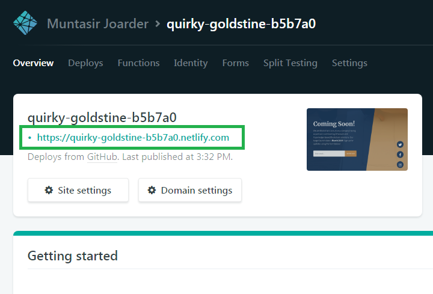

## **Goals:**

In this article, I am targeting to achieve the following four (4) goals through 24 steps. They are:

1. Convert a basic Bootstrap website template into a Gatsby powered website
2. Develop custom component if necessary
3. Deploy Gatsby website to Netlify CMS
4. Conducting Google Page Speed review

So what is [Gatsby](https://www.gatsbyjs.com/)? To understand we need to little bit understand the modern web development stack.

Initially when the internet first came all the websites were static and composed  of static HTML, CSS files with images and links. Then came the trend of  dynamic websites (ie client/server) where the script (ie PHP, ASP and so on) will read data from a database and will generate the HTML on the  fly. On the same trend came the concept of CMS (Content Management  Systems) like Wordpress, Drupal, Sitecore and so on. The modern trend of web development is using JAMStack, where sites are developed using  Javascript fetching data using reusable APIs where the content prebuilt  with the Markup language. These sites are compiled and built into static pages using any static site generators and get deployed to static web  hosts like Netlify, Amazon S3, Github pages and so on.

## **Gatsby**

Gatsby is a static site generator which separates data, development and  content editing. Gatsby is plugin rich with different data sources where the developers use GraphQL to get the data and React.JS to present that data. Content creators can create/edit content in any headless CMS like Contentful, Ghost CMS or even Wordpress. A site is composed of few  compiled static files that can be deployed to any static web host  Netlify, Amazon and so on.

Before we go through the steps please make sure that you have installed:

1. Node and NPM: Visit the [node.js download page](https://nodejs.org/en/download/) and install node and npm. Run the following command in the command line to check that you have Node and NPM installed:

```
node -v && npm -v
```

1. Git: Visit Github and [signup](https://github.com/join) a free personal account. Also, [download](https://git-scm.com/downloads) and install Git in your local machine.
2. Gatsby CLI: Install Gatsby command line tool with the following command

```
npm install — global gatsby-cli
```

So now let's start with the steps:

## Step -1

Create new Gatsby default website in a folder ‘comingsoon’

```
gatsby new comingsoon
```

This should create a new basic Gatsby website and install npm modules. If  the installation is successful all you need to do is to run the  following command in terminal to serve the default website

```
gatsby develop
```

Now open a browser and browse http://localhost:8000 to visit the basic Gatsby website.


Site generated by the command `gatsby new comingsoon`

**Note:** I was using my Windows PC for the project. In my case, I received the  following error. If you receive the same there is a way around.


Permission error while installing NPM modules.

So from the error, you can see that this is a permission error which occurred when it tried to install the npm packages.

So I did the following steps to solve the issue:

1. Close the terminal window
2. Open a new terminal window as Administrator (ie “Run As Administrator”)
3. Go to your project folder (in my case “comingsoon”)
4. Then install the npm package with command

```
npm install
```

1. When done run `gatsby develop` to run your Gatsby site in development mode.
2. Open a browser and visit ‘http://localhost:8000’ to view the initial Gatsby site (same site as the purple one above)

**Gatsby Site structure**

Now cd into that folder (ie comingsoon) or open it in any editor (I used Visual Studio Code)


Gatsby website file and folder structure

There are quite a few folders there. But we will concentrate on the folder  ‘src’ where we will work more. Under source there three folders:

- Components: Holding all the custom components built for this site.
- Images: Holds all the images
- Pages: All the pages for this website are kept here. Gatsby compiler will look for JS files inside this folder and will compile them into accessible  page links.

In the `/pages/index.js` page you can see a wrapper component `<Layout />` which is wrapping the content of this page.

If you analyse `page-2.js` you will see the same  `<Layout />` component is wrapping the page2 contents inside. Just keep this in your mind and we will have more on this later.

Great. So what now? Well, the main development starts now which is converting  the Bootstrap website into Gatsby powered website. Follow the following  steps:

## Step -2

I chose a simple Bootstrap theme from the website startbootstrap.com. [Download](https://startbootstrap.com/template-overviews/coming-soon/) the source code the “Coming Soon” theme.

After extracting the folder looks like as follows:


## Step -3

Now open the Gatsby site folder (ie the folder *comingsoon*) and create a new folder named ‘*dist*’ under `/src` folder at the same level as the folder ‘*components*’.

**Step -4**

Copy the following folders from Bootstrap folder to the /src/dist folder of your Gatsby website:

- css
- img
- mp4
- vendor

**Step -5 (CSS Integration)**

Let's open the *index.html* file of the Bootstrap theme to see what CSS are integrated there:


You will see that three types of CSSs are there:

1. Bootstrap CSS
2. Google Font CSS
3. Custom CSS

Open the `/comingsoon/src/components/layout.css` file, remove everything and add the following two lines:

```css
@import '../dist/vendor/bootstrap/css/bootstrap.min.css';
@import '../dist/css/coming-soon.css';
```

Which will include Bootstrap CSS and Custom CSS into the project.

Now to add the Google font we can use out-of-the-box Gatsby plugin `gatsby-plugin-google-fonts`.

```
npm install –save gatsby-plugin-google-fonts
```

to install the plugin.

Open `gatsby-config.js` file in your project root folder (ie outside of the src folder) and add the following as an item in the plugins array:

```css
{
 resolve: `gatsby-plugin-google-fonts`,
 options: {
 fonts: [
 `Source Sans Pro\:200,200i,300,300i,400,400i,600,600i,700,700i,900,900i`,
 `Merriweather\:300,300i,400,400i,700,700i,900,900i` 
 ]
 }
 },
```

Doing these completes CSS integration for this site.

## Step -6

Now we need to work on the wrapper component `<Layout />` 

1. Open `/comingsoon/src/components/layout.js` 
2. Remove header component related codes (ie line 5 and 21)
3. Remove inline CSS (line 22–29)
4. Remover footer (line 31–35)

With this, the wrapper is ready with Bootstrap CSS and we can start working on the homepage of the “Coming Soon” template.

## Step -7 (Content Integration)

Open `/src/pages/index.js`and delete the current contents (ie line 11–17, anything in between `Layout	` tags except the `SEO`tag.).

Copy all the contents between the `<body>` tags from the index.html of  the Bootstrap template. Exclude the `<script>` tags.

I think you got few errors. Ignore them for now. We will resolve them soon. Now in the `index.js`code

1. Replace all the `“class=” `with `“className=”`.
2. Add `/>` for any single item HTML tags like input, source and so on.
3. Create `const`variable for linked images and videos (ie anything which is linked by src should be referenced to a variable).

So we created a reference to our bg.mp4 file:

```react
const bgVideo = require(‘../dist/mp4/bg.mp4’)
```

and updated the source like as below:

```jsx
<video playsinline="playsinline" autoplay="autoplay" muted="muted" loop="loop"> <source src={bgVideo} type=”video/mp4" /> </video>
```

We don’t have any image in this template. So no more reference needs to be created.

## Step -8

Now we see the Twitter, Facebook and Instagram icons which we need to integrate. We are going to use an npm module ‘*react-icons*’ for this one. While inside the folder ‘comingsoon’ execute

```n
npm install react-icons –save
```

to install the module react-icons.

Visit https://react-icons.netlify.com/#/icons/fa to find your icon. 
For us we need to add the following line to import icons for Twitter, Facebook and Instagram:

```react
import { FaTwitter,FaFacebookF,FaInstagram } from ‘react-icons/fa’
```

then replace

```jsx
<i className=”fab fa-twitter”></i> With <FaTwitter />
```

Do the same for the other two icons.

## Step -9

Run `gatsby develop` to compile the site in development mode. 
Visit http://localhost:8000 to see how the site looks. 
It looks perfect except the blue section does not have 100% height.

I added the following CSS fix in the layout.css to solve this issue.

```css
#___gatsby,#bodycontent,#___gatsby>div{
height: 100%;
width: 100%;
}

.masthead {
height: 100%;
min-height: 0;
width: 40.5rem;
padding-bottom: 0;
}
```

Now looks perfect.

## Step -10 (Newsletter Section)

Now we need to work on Newsletter section

Create a new file newsletter.js in the `/src/components`folder which will hold the code for our Newsletter component.

```react
import React, {Component} from 'react'
import addToMailchimp from 'gatsby-plugin-mailchimp'

class Newsletter extends Component {
constructor(props){
    super(props);
    this.state = {
        showSuccess: false,
        showError: false,
        successMsg: '',
        errorMsg: ''
    }
}
 sleep = (delay) => {
    var start = new Date().getTime();
    while (new Date().getTime() < start + delay);
 }
 onSubmit = async (event) => {
     event.preventDefault();
     const email = event.target.yourmail.value || null;
    console.log(email);
     if(!email){
         return;
     }

     try{
         const result = await addToMailchimp(email,{});
         console.log(result.msg);
         this.setState({showSuccess: true});
         this.setState({successMsg: result.msg});
         this.setState({showError: false});
         this.setState({errorMsg: ''});
     }catch(err){
        console.log(err);
         this.setState({showSuccess: false});
         this.setState({successMsg: ''});
         this.setState({showError: true});
         this.setState({errorMsg: err});
     }
 }
 render(){
     return(
         <>
        <form onSubmit={this.onSubmit}>
            <div className="input-group input-group-newsletter">
                <input name="yourmail" type="email" className="form-control" placeholder="Enter email..." aria-label="Enter email..." aria-describedby="basic-addon" />
                <div className="input-group-append">
                    <button className="btn btn-secondary" type="submit">Notify Me!</button>
                </div>
            </div>
        </form>
        <br/>
        <div className={this.state.showSuccess? 'alert alert-success':'alert alert-success hideme'} dangerouslySetInnerHTML={{__html:this.state.successMsg}} />
        <div className={this.state.showError? 'alert alert-danger':'alert alert-danger hideme'} dangerouslySetInnerHTML={{__html:this.state.errorMsg}} />
     </>
     )
 }
}

export default Newsletter
```

## Step -11

Now in the `index.js`file add the Newsletter component

```
import Newsletter from ‘../components/newsletter’

```

and replace the newsletter code

```html
<div className=”input-group input-group-newsletter”>
<input type=”email” className=”form-control” placeholder=”Enter email…” aria-label=”Enter email…” aria-describedby=”basic-addon” /><div className=”input-group-append”>
<button className=”btn btn-secondary” type=”button”>Notify Me!</button>
</div>
</div>
```

With

```jsx
<Newsletter />
```

I am using MailChimp as my newsletter platform. So this component should  add the email address to a MailChimp list of my choice. Luckily Gatsby  has a plugin out-of-the-box for this one. That is `gatsby-plugin-mailchimp`.

```
npm install — save gatsby-plugin-mailchimp
```

to install the plugin.

Now add the plugin in `gatsby-config.js`file like as follows:

```javascript
{
resolve: ‘gatsby-plugin-mailchimp’,
options: {
endpoint: ‘’,
},
},
```

Now we need to add the endpoint URL of my list.

Check the URL https://www.gatsbyjs.org/packages/gatsby-plugin-mailchimp/ to find out how to get the MailChimp list endpoint. It will be something like (get your one):

https://example.us10.list-manage.com/subscribe/post?u=b9ef2fdd3…

## Step -12

Run `gatsby develop`and test the newsletter subscription. As per your MailChimp subscription you should be able to receive emails.

# Deploying to Netlify

Before starting these steps make sure that you got your Github account created.

## Step -13

Visit https://github.com/muntasirjoarder/gatsby-comingsoon-bootstrap

## Step -14

Click `Deploy to Netlify` button


## Step -15

Now connect to your Github account


## Step -16

Give it a repository name that you prefer. You can keep it same. Now save and deploy.


## Step -17

You will see “Site Deploy in Progress”. You will see “Site Deploy Failed”.  Don’t worry. This is because we need to define some Environment  Variables in Netlify and then redeploy.


## Step -18

Go to Site Settings --> Build and Deploy and look for `Build environment  variables`. Add the following variables (with your information)


## Step -19

Now go to “Overview”


## Step -20

Click “Site Deploy Failed”


## Step -21

Click the on the master HEAD that failed latest.


## Step -21

Click “Clear Cache and Deploy”


## Step -22

After some time you will see that your site is live. Now click the URL to access your static Gatsby site



## Step -23

And your site is accessible using the link generated by Netlify. You can  change it to a human-readable name. Also, you can point your custom  domain to this Netlify website. At this point, you converted your  Bootstrap theme to Gatsby website.


## Step -24

Now go to [Google Page Speed Insight](https://developers.google.com/speed/pagespeed/insights/) page and put your website address to check the score. I found that for  Desktop I scored 100/100 even doing nothing all. This is out-of-the-box  optimization from Gatsby.


At this moment, your Netlify website is deployed as “Continuous Deployment” and pointing to your Github repository.


Any change in code in your Git repository will cause the Netlify website to automatically gets build and deployed. Great isn’t it?

My article finishes here for today and my site URL is:

https://ledgerchain.netlify.com/

You will have something else.

You can do multiple things now:

- **Change Url:** Go to Site Details à Change Site Name and try with your name. If the name is not taken you may get that. I got https://ledgerchain.netlify.com. Feel free to visit and subscribe to my mailing list. I will come back to you with interesting articles and offers.
- Add custom domain: I am not discussing this today.
- Add sitemap, offline page visiting, adding schema and so on.
- You can create multiple pages on your site also.

I transferred my personal website https://muntasirjoarder.net/ to Gatsby which gave me a huge speed boost.


Today up to this. I have the plan to write more in-depth articles regarding  developing web application s in Gatsby. So stay tuned.